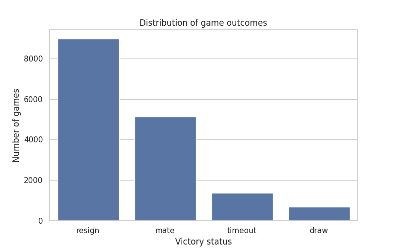
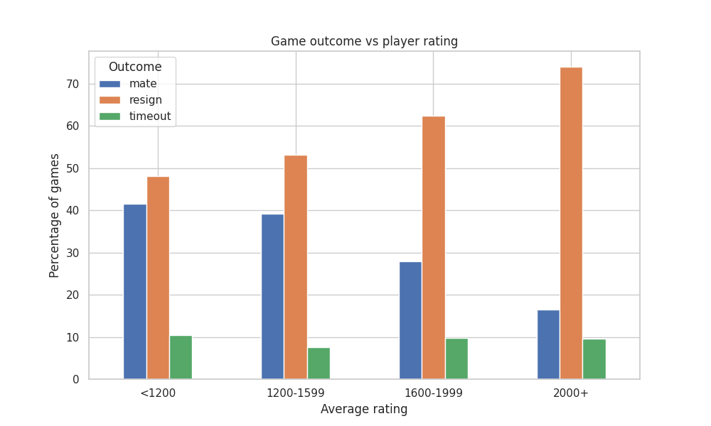

# How Do Online Chess Players Lose Games?

Chess is often described as a game of strategy, precision, and long-term planning. But in practice, many games do not end with a dramatic checkmate on the board.
Instead, players resign, run out of time, or agree to draw.
This project explores how online chess games actually end and whether the way games are lost changes with player skill level.
Using a public dataset of over 20,000 games from Lichess, the analysis focuses on:
- how frequently games end by resignation, checkmate, or timeout
- how these outcomes vary across diffrent rating levels
- how opening choices differ between players of varying skill

The goal is not to find the "best" way to win, but to better understand patterns in how players lose - and what this reveals about decision-making in chess.

## Research Questions

This analysis is structured around following key questions: 

1. How do rated chess games most commonly end?
2. Does the way a game ends depend on player rating?
3. How are opening types distributed across games?
4. Do opening choices differ between players of diffrent skill levels?

## Results

### 1. How do rated chess games most commonly end?

Resignation is the most common way games end, significantly more frequent than checkmate or timeout.
This suggests that many games are decided before checkmate occurs, as players tend to resign once a losing position becomes clear.

---

### 2. Does the way a game end depend on player rating?

As player rating increases, the proportion of games ending in resignation rises, while the proportion of checkmates decreases.
This indicates that stronger players are more likely to recognize losing positions earlier and resign, rather than playing until checkmate.
