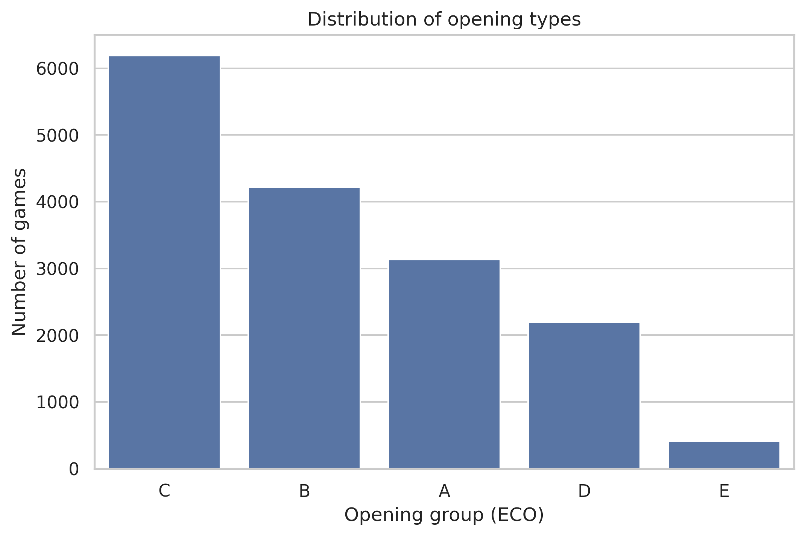
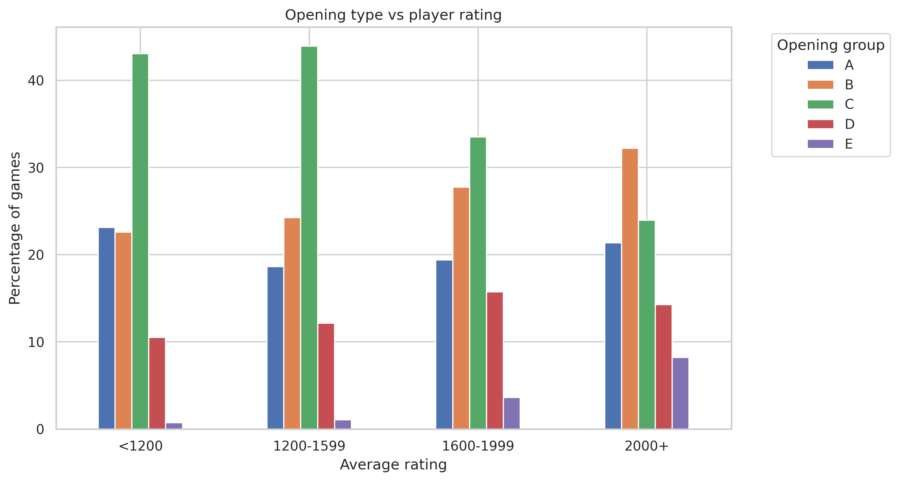

# How Do Online Chess Players Lose Games?

Chess is often described as a game of strategy, precision, and long-term planning. But in practice, many games do not end with a dramatic checkmate on the board.
Instead, players resign, run out of time, or agree to draw.
This project explores how online chess games actually end and whether the way games are lost changes with player skill level.
Using a public dataset of over 20,000 games from Lichess, the analysis focuses on:
- how frequently games end by resignation, checkmate, or timeout
- how these outcomes vary across diffrent rating levels
- how opening choices differ between players of varying skill

The goal is not to find the "best" way to win, but to better understand patterns in how players lose - and what this reveals about decision-making in chess.

## Research Questions

This analysis is structured around following key questions: 

1. How do rated chess games most commonly end?
2. Does the way a game ends depend on player rating?
3. How are opening types distributed across games?
4. Do opening choices differ between players of diffrent skill levels?

## Results

### 1. How do rated chess games most commonly end?

 
Resignation is the most common way games end, significantly more frequent than checkmate or timeout.
This suggests that many games are decided before checkmate occurs, as players tend to resign once a losing position becomes clear. 
Timeouts occurs less frequently, indicating that most games are decided by by position rather than time pressure.
Draws are present but relatively rare, which justifies focusing further analysis on decisive game outcomes.

---

### 2. Does the way a game end depend on player rating?

 
As player rating increases, the proportion of games ending in resignation rises, while the proportion of checkmates decreases.
This indicates that stronger players are more likely to recognize losing positions earlier and resign, rather than playing until checkmate.
Timeout remains relatively stable across rating groups and does not show a strong dependency on player skill level. 

---

### 3. Which opening types are most frequently chosen?

Opening choices are concentrated in a few groups, with categories C and B making up the majority of games. These groups are typically associated with open and semi-open games, leading to more dynamic positions with faster piece activity and earlier tactical opportunities.
In contrast, closed and semi-closed openings (groups D and E) appear less frequently and are generally linked to slower, more strategic play, where positions develop more gradually.
Group A represents a more diverse set of opening systems that do not fit as clearly into typical open or closed structures, which may explain its moderate but consistent presence.
Overall this suggests that most games tend toward more dynamic and active play, while slower and more positional approaches appear less frquently. 

### 4. Do opening choices differ by player rating?

Opening preferences vary noticeably across rating levels, indicating that players approach the game differently depending on their skill.
Lower-rated players tend to favor opening groups associated with more direct and dynamic play, where early activity and tactical opportunities are more common.
As rating increases, the distribution of opening choices becomes more balanced, with growing share of closed and semi-closed structures that typically require more strategic planning and positional understanding. 
At the same time, the dominance of open games decreases, suggesting that stronger players are less reliant on immediate tactical play and more comfortable navigating a wider range of more complex positions.
Overall, higher-rated players appear to use a more diverse set of opening strategies, reflecting a broader understanding of different types of positions.
This may suggest that lower-rated players tend to choose opening based on simplicity and accessibility, while stronger players are more likely to select openings aligned with their preferences, supported by greater experience and a deeper understanding of strategic concepts.

## Final Conclusions
This project explored how online chess games unfold, focusing on game outcomes, opening choices and how both relate to player skill.
The analysis shows that most games end by resignation, suggesting that players often recognize losing positions before reaching checkmate. As player rating increases, game outcomes shift, reflecting diffrences in decision-making and game awareness.
Opening choices also reveal clear patters. Players tend to rely on limited set of opening types, with more dynamic structures being the most common. However, as skill level increases, opening preferences becoe ore diverse and shift toward more strategic, positional play.
Overall, the results highlight how player behavior evolves with experience - from early opening decisions to how games are ultimately concluded - providing insight into how different skill levels approach the game.
